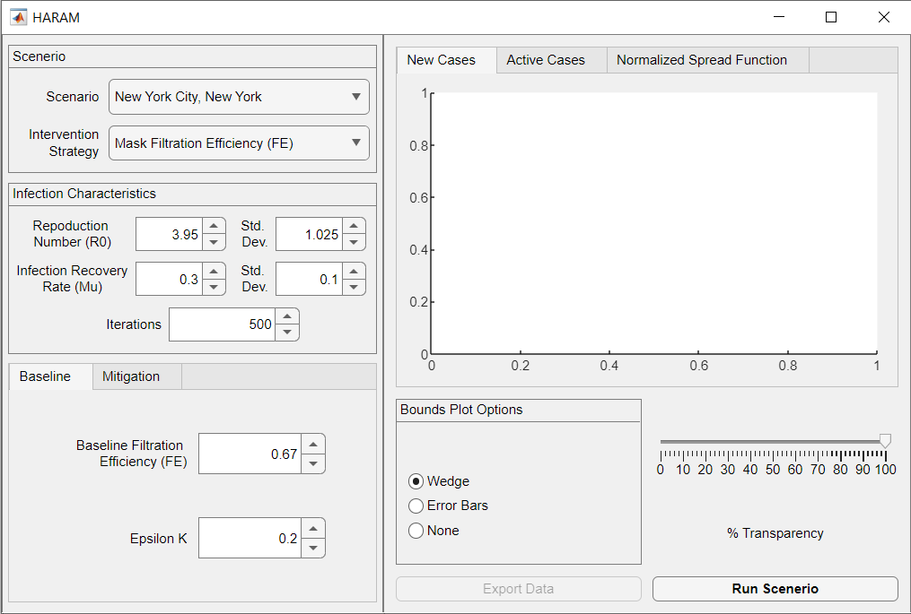
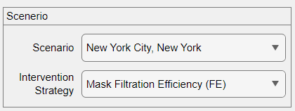
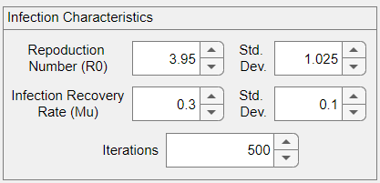
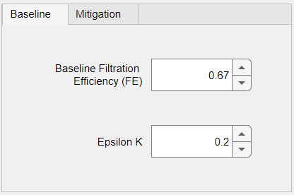
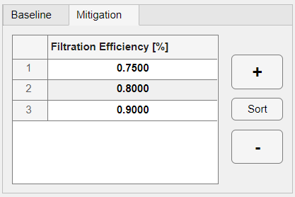
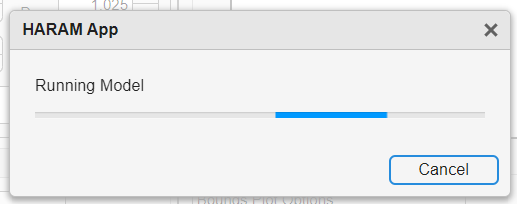
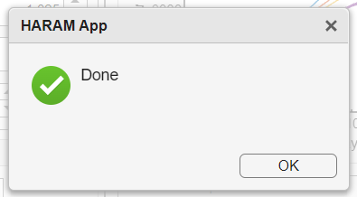
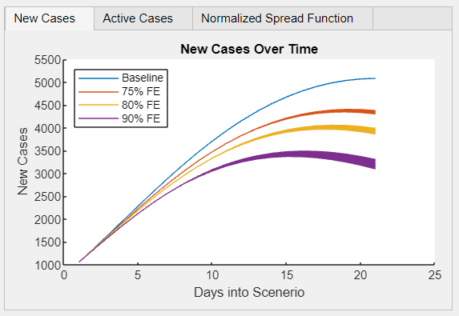
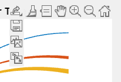
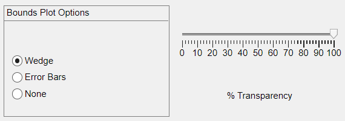

# Highly Adaptive Risk Assessment Mode (HARAM) Graphical User Interface (GUI)

**Highly Adaptive Risk Assessment Mode (HARAM) Graphical User Interface (GUI) for the "dynamic-spread" Susceptible-Infected-Removed (SIR) model.**

Written By: Alexander Herman, Gavin D'Souza, Matthew Myers 
U.S. Food and Drug Administration 
Revised: 20-Nov-2023

This Highly Adaptive Risk Assessment Model (HARAM) is based on the "dynamic-spread" Susceptible-Infected-Removed (SIR) model published by and [Osborn et al.](https://www.sciencedirect.com/science/article/pii/S0025556421001279)[[1]](#Reference-1), [D'Souza et al.](http://www.aimspress.com/article/doi/10.3934/mbe.2022445)[[2]](#Reference-2), [Berman et al.](http://www.aimspress.com/article/doi/10.3934/mbe.2023663)[[3]](#Reference-3) This application serves as a graphical frontend for the model used in the referenced publication. Information about the mathematics behind the model itself is presented in publications. <!--This is being presented as a Regulatory Science Tool and is available under the following submission *{filled in when accepted}* -->

## Disclaimer

* This code is available under public domain, free of all copyright, and may be freely reproduced, distributed, transmitted, modified, built upon, or otherwise used by anyone for any lawful purpose. However, this license does not govern the software needed to run this script and dependent functions and are governed under a separate license. 
* This code, and its dependent functions are listed "AS IS" and does not come with any expressed or implied warranty. The authors of this code and its dependent functions are not liable for any damages arising from the use of this code and its dependent functions.
* The use of the files in this repository, the code presented in it, its dependent functions, the software required to run it, or the code's outputs does not constitute an endorsement from the U.S. Food and Drug Administration or U.S. Department of Health and Human Services.

## Download and Starting the GUI

The model is released as a Windows executable that was compiled with the MATLAB Compiler. The source code is also available for users who already have MATLAB installed.

### Windows Executable

The Windows executable can accessed from the *Releases* section of the repository. The executable is an online installer that installs both the model and the MATLAB Runtime, the latter of which is required in order to run the model. While the model itself is small in size, the Runtime requires at least 2.1 GB of disk space. The installation process also requires an internet connection to download the required files. The required R2023a Runtime can also be downloaded [here](https://www.mathworks.com/products/compiler/matlab-runtime.html). After the installation the model can be found in Start Menu, or on a Shortcut on the Desktop if selected. We suggest this only be run on computers with at least 8 GB of memory.

**NOTE**: The installer is not signed. As a result, Windows and potentially the web browser when downloading the model will flag the installer as a file that can harm your computer. The executable is safe for your computer and is safe to run without it affecting other applications or the Windows installation.

### MATLAB/Source Code

The model source code is also provided in the repository for the model. It is available as a standard MATLAB script or a MATLAB App designed with the App Designer. All of the MATLAB functions and data files in the root of the repository are required for the model to run. The Statistic and Machine Learning (SML) Toolbox is also required. The only two functions that require the SML Toolbox are `normpdf` and `normcdf` within the `LHS.m` function. If running from MATLAB, the model can be launched from running either `HARAM_App_Published.mlapp` or `HARAM_App_Published_exported.m`. 

## Layout

The model allows for the selection of the 4 different scenarios used in the publications and 3 different intervention strategies based on COVID-19 case data. Inputs are on the left panel of the GUI and Outputs are on the right side of the GUI. 

Inputs are broken into 3 different sections. Scenario, Infection Characteristics, and Baseline/Mitigation Tabs. The default values for each section for all of the Scenario/Intervention combinations are the values used for the publications.

## Input - Scenario

The Scenario section shows two drop downs where the user can select either a Scenario or a Intervention Strategy 

### Scenario Dropdown

In the Scenario section, there are 2 drop down boxes with one labeled Scenario and the other label Intervention Strategy. The Scenario dropdown allows the user to select one of 4 different locations analyzed in the publication

* New York City
* New York State
* Diamond Princess Cruise
* Harris County, Texas

Changing the Scenario resets the infection characteristics to their default values.

### Intervention Strategy

The Intervention Strategy dropdown allows the user to select one of the 4 different intervention strategies

| Intervention | Description |
| :---: | :--- |
| None | No intervention strategy used evaluated |
| Mask Filtration Efficiency (FE) | Fraction of droplets emitted by an infected person that is filtered by the mask. |
| Mask Compliance (MC) | The fraction of the infected population wearing masks, relative to the baseline value.  Baseline percentage is calculated by the model. |
| Social Distancing (SD) | Level of distancing between people, relative to the baseline value. Baseline value is calculated by the model. |

Changing the Intervention strategy resets the values in the Baseline/Mitigation Tabs to their default values.

## Input - Infection Characteristics

In the Infection Characteristics section shows 5 number spinners where the user can change the reproduction number of the infection and it standard deviation, the infection recovery rate and it standard deviation, and the number of iterations the model should run.

### Reproduction Number (*R0*)

The reproduction number of the infection or *R0* as outlined in the publications is defined as the number cases on average one person with an infection in a population produces over the course of the infection[[4]](#Reference-4). This number is typically found in literature for a particular infection and can be a range of values. In this interface, it allows you to enter the *R0* value in the first row in the Infection Characteristics section along with a standard deviation for it to the right of the *R0* spinner. A standard deviation is a measure of variation between an average or mean value. A standard deviation is not need when uncertainty quantification (UQ) analysis is not performed (See [Iterations](#Iterations) section below).

### Infection Recovery Rate (*Mu*)

The infection recovery rate (*Mu* or *μ* as outlined in the publications) is rate at which people recover from the infection. It is defined as reciprocal of the number of days it takes a person to recover from the infection. This number is typically found in literature for a particular infection and can be a range of values. In this interface, it allows you to enter the *Mu* value in the second row in the Infection Characteristics section along with a standard deviation for it to the right of the *Mu* spinner. A standard deviation is a measure of variation between an average or mean value. A standard deviation is not need when UQ analysis is not performed (See [Iterations](#Iterations) section below).

### Iterations

The iterations spinner at the bottom of the Infection Characteristics selects the number of uncertainty simulations to perform. The UQ analysis executes the model the number of times specified by the iterations spinner. It vary the inputs of the Reproduction Number (*R0*) and Infection Recovery Rate (*Mu*) across an even distribution based on the values based on their values and standard deviations. In this interface, the UQ analysis is optional but it is on by default, to disable it, change the number of iterations in the iteration spinner to 1. Standard deviations of Reproduction Number (*R0*) and Infection Recovery Rate (*Mu*) are not required as well when the number of iterations is set to 1. If UQ analysis is desired, the number of iterations must be above 200, as having the number iterations any number lower would reduce the reliability of the model.

#### Auto Iteration

The model requires a minium of 200 samples to not cause a singularity condition. If the model does not meet the singularity condition then it will automatically run again with previous iteration number value plus 50. It will do this until 200 samples do not meet the singularity condition or until it increases the number of iteration 20 times. If the model reaches the latter condition the model will error out and state to increase the number iterations or change the infection characteristics. Each iteration requires between a few seconds to a few minutes of computation time.

## Input - Baseline Tab

The Baseline Tab is one of the 2 tabs at the bottom of the input panel and it consists of 2 spinner inputs, the Baseline Filtration Efficiency and Epsilon K. The inputs in this tab are specific to strategies that utilize a facemask. This tab can be accessed by pressing <kbd>Ctrl</kbd> + <kbd>B</kbd>.

### Baseline Filtration Efficiency

The Baseline Filtration Efficiency is the assumed Filtration Efficiency (FE) of the masks worn by the infected persons in the selected scenario. This is a values that can range from 0 to 1. The default value is 0.67. This value is specific to strategies that utilize a facemasks.

### Epsilon K

Epsilon K or *εK* as outlined in the publications, is the fraction of variation in spread function due to reduction in droplet production resulting from the use of masks. The spread function comprehensively characterizes the infection dynamics over time. Specific information regarding Epsilon K or the spread function can be found in any of the three publications. This value is specific to strategies that utilize a facemasks.

## Input - Mitigation Tab

The Mitigation Tab is one of the 2 tabs at the bottom of the input panel and it consists of a single table, and buttons to add, remove and sort the values in the table. This tab can be accessed by pressing <kbd>Ctrl</kbd> + <kbd>M</kbd>.

### Mitigation Table

The table consists of values characterizing the mitigation strategies featured in the simulation. The values themselves means different things depending on the Intervention Strategy selected. See table in [Intervention Strategy](#Intervention-Strategy) for a description on what the values in the mitigation table represent. There is no limit to the number of values that can be present here but we recommend no more than 6 values as adding more can hinder the readability of the output plots.

The buttons to the right of the table perform the following functions:

| Button | Function |
| :---: | :--- |
| `+` | Add a Row to the bottom of the table with a blank value |
| `Sort` | Sorts the rows in the table by ascending order |
| `-` | Remove a row from the bottom of the table |

The minus `-` button is disabled when there is only 1 row remaining. If no mitigation values are to be tested, set the Intervention Strategy dropdown to None.

## Running the Model

1. Select the desired Scenario and Intervention Strategy to be evaluated
1. Input the *R0* and *Mu* values. Leave as default if data from the publications is desired.
1. If performing UQ (default) set the number of iterations to run and input the standard deviations for the R0 and Mu values. Leave as default if data from the publications is desired.
1. Input the Baseline data in the baseline tab if running the model with strategies that utilize facemasks. Leave as default if data from the publications is desired.
1. Input Mitigation data to evaluate in the Mitigation Tab. Leave as default if data from the publications is desired.
1. Click the `Run Scenario` Button to run the model or press the <kbd>F5</kbd> key. Button text will be bolded when the inputs have changed since the model was last run and at startup.
   
1. A running dialog will appear. The running of the model can be cancelled by clicking the `Cancel` button in the dialog that appears. Note that running the model can take anywhere from a few seconds to a few minutes depending on the input parameters selected.
   
1. If the model was successfully run, a dialog box will appear indicating success, and the output plots will be displayed.
   

## Output - Plots

After the model has been successfully run, the data will be displayed into one of 3 plot windows. Either the number of new cases over time, the number of active cases over time, or the normalized spread function over time will be shown. For all of the plots, a toolbar will appear in the upper right corner when hovered over with the cursor. That allows for different functions such and panning, zooming, saving the plot and resetting the plot view.

Each function of the toolbar and its respective icon perform the following functions:

| Icon | Function |
| :---: | :--- |
|  | Export options, hover over this icon to reveal a drop down with 3 different export options below.|
|  | Save the plot as a tightly cropped image or PDF.|
|  | Copy the plot as an image.|
|  | Copy the plot as a vector graphic.|
|  | Brush/Select data points on the plot.|
|  | Place and manipulate datatips on the plot.|
|  | Move the data (pan) on the plot.|
|  | Zoom in on the plot.|
|  | Zoom out on the plot.|
|  | Restore the original view of the plot.|

### New Cases Plot

This tab shows the number of new cases (infections) over time. From the manuscript this is the variable *T*. This tab can be accessed by pressing <kbd>Ctrl</kbd> + <kbd>T</kbd>.

### Active Cases Plot

This tab shows the number of active cases (infections) over time. From the manuscript this is the variable *I*. This tab can be accessed by pressing <kbd>Ctrl</kbd> + <kbd>I</kbd>.

### Normalized Spread Function Plot

This tab shows the normalized spread function. From the manuscript this is the variable lowercase delta normalized to the the initial delta, or *δ/δ0*. This tab can be accessed by pressing <kbd>Ctrl</kbd> + <kbd>D</kbd>. Only baseline data is plotted as that what was presented in the publications.

### Known Issue with Plots

Sometimes after running the model the color the wedge or error bars (if enabled) do not match up to the colors of the variable they correspond to. While the data itself is correct, it can cause confusion when looking at the plot to determine which error bars or wedge plot belong to which variable. Sometimes rerunning the model can fix the issue and or changing the inputs, running it, change them back and it again. If this fails, feel free to export the data (See [Exporting Data](#output---export-data)) and plot it in external plotting software such as Excel.

## Output - Bound Plot Options / Slider

When run the with UQ, the plot will show selected variable (based on the tab selected) along with an upper and lower bound for each values. This section allows for changing the view of the upper and lower bound on the plot. 

### Plot Options Buttons

The Plot Option button or Bound Plot option allows the user to either show a wedge on the plot that shows the upper and lower bound (`Wedge`), error bars that show the upper and lower bounds (`Error Bars`), or no bound plot options (`None`). This option is disabled when UQ is not run from the analysis.

### Bound Plot Slider

The Bound Plot Slider changes its function depending on what option in the [Plot Options Buttons](#plot-options-buttons) is selected. The different functions are listed in the table below. The label of the slider is also changed according to the option selected

| Bound Plot Option | Function of Slider |
| :---: | :--- |
| Wedge | Slider changes the transparency of the wedges plots. |
| Error Bars | Slider changes the number of error bars on the plot |
| None | Slider is disabled |

## Output - Export Data

The interface allows for the export of data that was produced by the model. Clicking the `Export Data` button or pressing <kbd>Ctrl</kbd> + <kbd> S</kbd> will bring up a "Save As" with a drop down box that allows the data to be exported in  3 different file formats, CSV files (.csv), an Excel Spreadsheet (.xlsx), and a MATLAB Data File (.mat). The data that is exported results in 5 variables and are described in the table below.

| Export Variable | Description of Variable |
| :---: | :--- |
| T | Table of the new cases plot data. Size is the number of mitigation values plus the baseline multiplied by 3. Each value has 3 columns representing the mean, upper (Ub), and lower (Lb) bounds. If UQ was not performed, then the mean, Ub, and Lb columns are the same. |
| I | Table of the active cases plot data. Size is the number of mitigation values plus the baseline multiplied by 3. Each value has 3 columns representing the mean, upper (Ub), and lower (Lb) bounds. If UQ was not performed, then the mean, Ub, and Lb columns are the same. |
| delta | Table of the normalized spread function plot data. Unlike the plot, the mitigation variables are available in the export. Size is the number of mitigation values plus the baseline multiplied by 3. Each value has 3 columns representing the mean, upper (Ub), and lower (Lb) bounds. If UQ was not performed, then the mean, Ub, and Lb columns are the same. |
| SigCount | Logical array showing which iteration did not meet the singularity condition, with the size of it being the number of iterations being performed, value is false if UQ was not performed. |
| Inputs | Table of the inputs from the model used to create the data. |

Each type of export handles the 5 variables differently and the description of how each variable is handled in the data export is detailed in the table below. 

| Export Options | Description of Export |
| :---: | :--- |
| CSV | 5 different CSV files are exported, one for each variable. SigCount and Inputs are converted to tables. Variable name is appended to the typed in name in the "Save As" dialog |
| XLSX | Each variable exported as a sheet in the workbook, SigCount and Inputs are converted to tables |
| MAT | Exports a MATLAB data file containing the T, I, and delta as a table, SigCount being a logical array, and Inputs being a structure. |

The exporting of data is not available if the model has not been run. It will also present an alert if `Export Data` has been clicked or  <kbd>Ctrl</kbd> + <kbd>S</kbd> has been pressed and the inputs have been changed before the model has been re-run.

## References
<!--- cSpell:disable -->
<ol type="1">
  <li id="Reference 1">Jenna Osborn, Shayna Berman, Sara Bender-Bier, Gavin D'Souza, Matthew Myers. Retrospective analysis of interventions to epidemics using dynamic simulation of population behavior. Mathematical Biosciences, 2021, 341: 108712. doi: <a href="https://www.sciencedirect.com/science/article/pii/S0025556421001279">10.1016/j.mbs.2021.108712</a></li>
  <li id="Reference 2">Gavin D'Souza, Jenna Osborn, Shayna Berman, Matthew Myers. Comparison of effectiveness of enhanced infection countermeasures in different scenarios, using a dynamic-spread-function model. Mathematical Biosciences and Engineering, 2022, 19(9): 9571-9589. doi: <a href="http://www.aimspress.com/article/doi/10.3934/mbe.2022445">10.3934/mbe.2022445</a></li>
  <li id="Reference 3">Shayna Berman, Gavin D'Souza, Jenna Osborn, Matthew Myers. Comparison of homemade mask designs based on calculated infection risk, using actual COVID-19 infection scenarios. Mathematical Biosciences and Engineering, 2023, 20(8): 14811-14826. doi: <a href="http://www.aimspress.com/article/doi/10.3934/mbe.2023663">10.3934/mbe.2023663</a></li>
  <li id="Reference 4">Christophe Fraser, Christl A. Donnelly, Simon Cauchemez, William P. Hanage, Maria D. Van Kerkhove, et al. Pandemic Potential of a Strain of Influenza A (H1N1): Early Findings. Science, 2009, 324(5934): 1557-1561. doi: <a href="https://www.science.org/doi/10.1126/science.1176062">10.1126/science.1176062</a></li>
</ol> 
<!--- cSpell:enable -->
